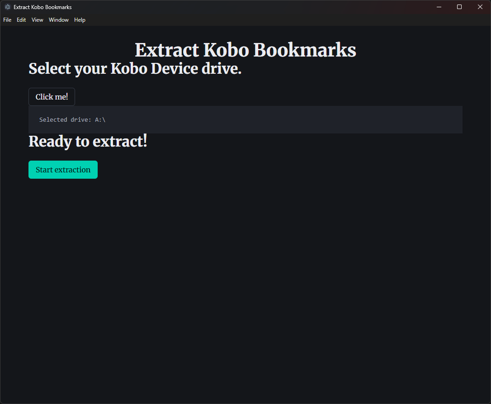

# Extract Kobo Bookmark

If like me you're reading mangas on a Kobo Reader and wanted to export manga pages to share funny pics with your friends, welcome on this page! It's sad that it is not a native function of our readers :(

# How to use

Later, there will be releases already built to download right from GitHub but right now:
- clone the repository
- run `npm install` from the projectroot folder
- then `npm run dev`

If you want to build the app: `npm run build` and you'll get an install and a portable version of the application.

# Contributing

It's too soon to contribute to this repository, sorry :3 Feel free to fork!

# Screenshot

(Be warned, this is not the final style at all, it is only the current appearance of the app, the design will be done *later*)

# Notes

This project is based on this boilerplate: https://github.com/kethakav/electron-vite-react-boilerplate

Thanks for this template <3
